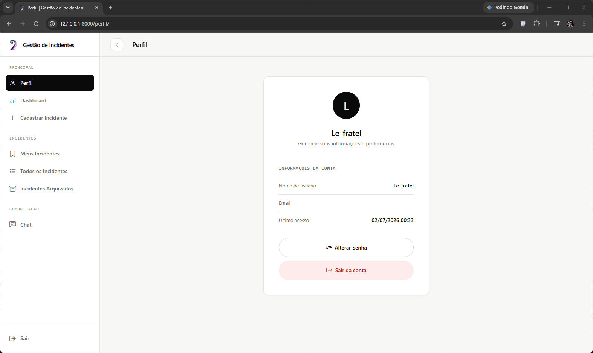
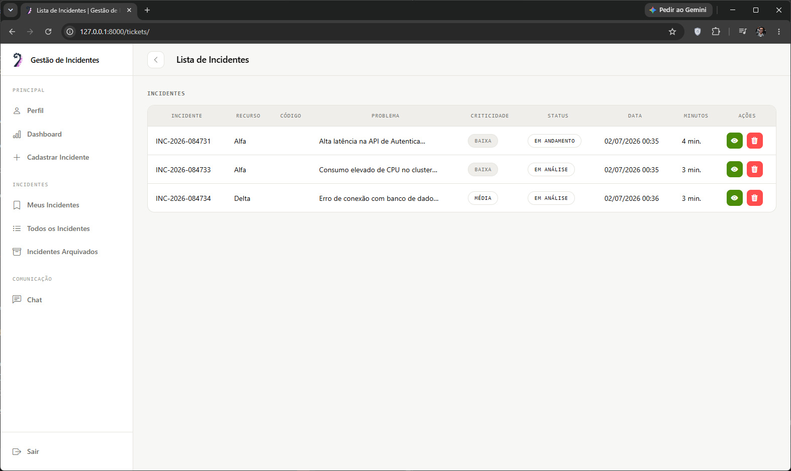
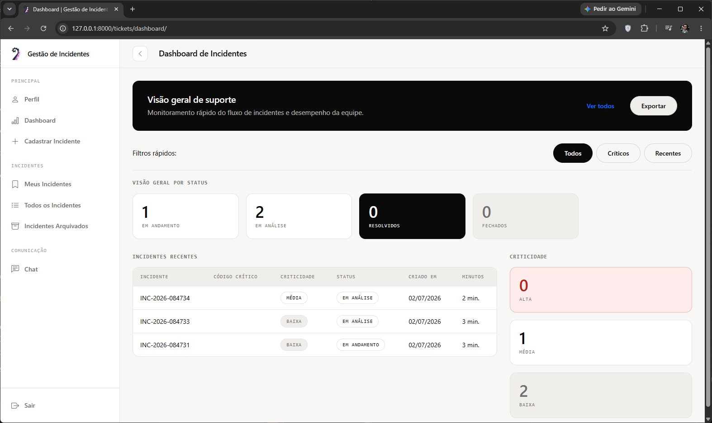
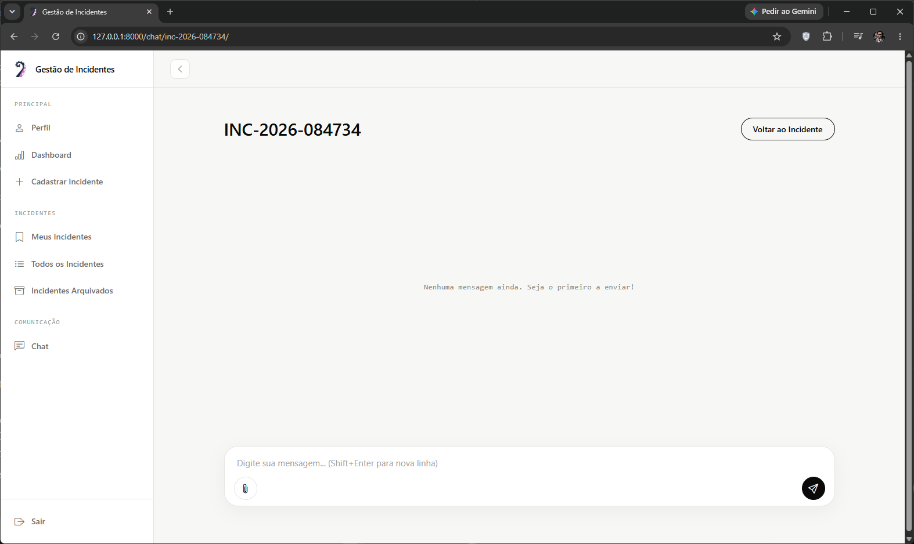

**Sistema de Gerenciamento de Tickets com Chat Integrado**

O **Sistema** é uma plataforma minimalista e sofisticada para gestão de tickets de suporte, inspirada no design clean do Notion e em interfaces intuitivas como Slack e Microsoft Teams. Desenvolvido com **Django** e **WebSockets**, ele proporciona comunicação em tempo real para a resolução eficiente de chamados.

#### Login
<div align="center">
  
</div>

#### Incidentes
<div align="center">
  
</div>

#### Dashboard
<div align="center">
  
</div>

#### Chat do Incidente
<div align="center">
  
</div>

### **Principais Funcionalidades**
- **Gestão de Tickets:** Abertura, edição e fechamento de incidentes.
- **Chat em Tempo Real:** Cada ticket gera automaticamente uma sala de bate-papo dedicada.
- **Interface Moderna:** Design limpo, minimalista e responsivo, priorizando usabilidade.
- **Autenticação Segura:** Sistema de login e controle de acessos.
- **Dashboard Intuitivo:** Visão geral de tickets e interações.
- **Perfis de Usuário:** Customização e gestão de informações pessoais.

### **Tecnologias Utilizadas**
- **Backend:** Django + Django Channels (WebSockets para chat em tempo real)
- **Frontend:** HTML, CSS, JavaScript (com um design minimalista e funcional)
- **Banco de Dados:** PostgreSQL
- **Autenticação:** Django Auth

### **Próximos Passos**
- Login com o Google
- Subir a aplicação para o Docker

---

## **Configuração do Ambiente**

### **1. Criando e ativando o ambiente virtual**
```bash
python -m venv venv
source venv/bin/activate  # No Windows, use: venv\Scripts\activate
```

### **2. Instalando as dependências**
```bash
pip install -r requirements.txt
```

### **3. Aplicando as migrações do banco de dados**
```bash
python manage.py migrate
```

### **4. Criando um superusuário (opcional, para acessar o admin)**
```bash
python manage.py createsuperuser
```

### **5. Iniciando o servidor**
```bash
python manage.py runserver
```

Agora, acesse o sistema em **http://127.0.0.1:8000/** e aproveite!
